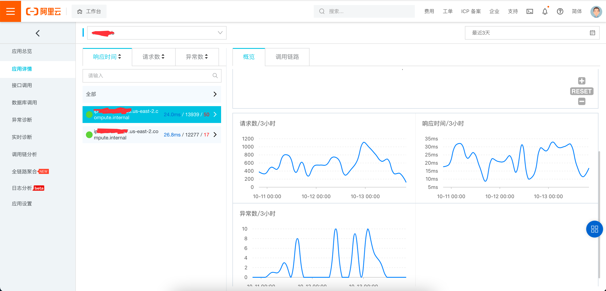

Hermes是提供给Java应用使用的Apm解决方案。
* 基于Apache Skywalking Agent Core.
  1. 复用了对于byte-buddy的封装
  2. 复用了logging日志模块
  3. 复用了config配置
  4. 复用了BootService
  5. 做了一些优化定制  
    
    
* Tracing协议基于Open-telemetry.
  1. Skywalking在实现Open-tracing的时候做了一些选择。考虑到OAP对于异步Span的处理，会让一整个TraceSegment完全结束后再上报，有一定的内存压力(弃用该策略不是因为它不好，只是选择不同)。
  2. Open-telemetry相对来说对于内存的使用会小一些，每个Span结束后就会立刻上报。
  3. Open-telemetry的baggage相对难用，因此本项目自行实现了baggage.
  4. 开源项目对于Open-telemetry的兼容性较好，CNCF成员，未来可期。  
      
* 插件.
    1. elasticsearch: 实现了elasticsearch-rest-client的插件
    2. lettuce5: 实现了lettuce5的插件，可监控对redis的操作
    3. jdbc8: 实现了jdbc8的插件，可监控对mysql的操作(该插件的实现是搭配了mybatis5的，单独使用可能有问题)
    4. threading: 增强了`ThreadPoolExecutor`和`ForkJoinTask`,实现跨线程的链路追踪
    5. TODO: SpringMVC、Spring Service、RocketMQ、MyBatis...

* UI
  1. 阿里云链路追踪可接受jaeger协议的数据，链路图表功能不错，本项目使用阿里云链路追踪做UI
  2. 阿里云指标计算和展示需要另外的服务。本项目暂未加上指标采集上报。
  3. elastic-apm兼容原生Open-telemetry协议，图表非常好看，但是需要部署一个elastic-apm-server,架构相对复杂。
  4. 阿里云链路追踪UI展示：  

* 配置
  1. 应用名和环境  
     1. hermes.app.name: 应用名
     2. hermes.app.env: 环境(例如: dev、test、pre、pro)
  2. 阿里云链路追踪
     1. 需要开通阿里云链路追踪服务
     2. 查看接入点信息。
     3. 配置接入点信息  
        1. 打开`HermesSpanExporter`类
        2. 修改of方法里面的host为你的接入点。例如：`host=tracing-analysis-dc-us-east-1.aliyuncs.com`
        3. 修改of方法里面的auth为上图中的token字段(全部复制过来,token类似123@xxxx_123@yyy)
  3. 跨线程
     1. 修改`Config.Plugin.JdkThreading.THREAD_CLZ_PREFIXES`的配置，加上你的项目包名前缀，比如`com.taobao.buy2`

* 安装
  1. 将该项目下载到本地
  2. 执行`mvn clean install -Dmaven.test.skip=true`
  3. mac用户将会在桌面上看到一个`hermes-agent`目录(windows用户请修改hermes-parent.pom、hermes-plugin.pom的相关属性)
  4. 执行`java -javaagent:/path/to/hermes-agent/hermes-agent.jar -Dhermes.app.name=ur-app-name -Dhermes.app.env=dev -server -jar /path-to-your-app/app.jar`启动你的应用
  
